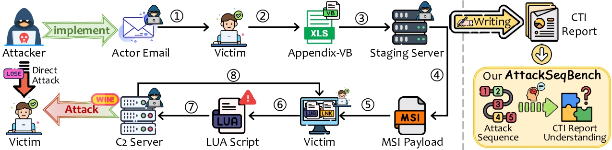
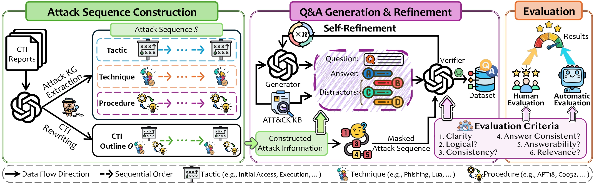
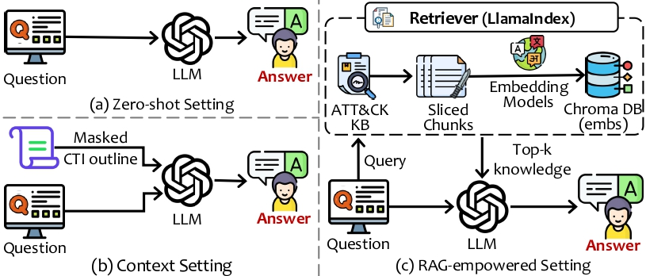
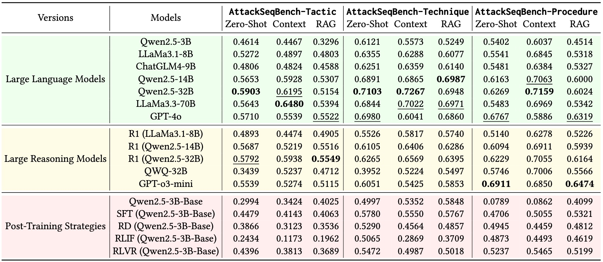

# AttackSeqBench
AttackSeqBench is a novel Question Answering (QA) benchmark designed to systematically evaluate the capabilities of LLMs in understanding attack sequences found in Cyber Threat Intelligence (CTI) reports. We carefully an automated dataset construction pipeline, enabling us to create a scalable and well-formulated QA dataset based on real-world CTI reports. AttackSeqBench consists of three tasks, each task focuses on the different aspects of adversarial behavior. We conduct extensive experiments and analysis with
a diverse set of fast-thinking and slow-thinking LLMs, while highlighting the strengths and limitations of LLMs in understanding and reasoning about the relationships between TTPs in attack sequences. The overarching goal of this work is to provide a benchmark that provide valuable insights into LLM-driven CTI operations and foster its application in real-world cybersecurity applications. Our dataset can be found in the `/dataset` directory.

## Dataset Construction Pipeline
The dataset comprises of three benchmarking tasks follows the three-level structure of adversarial behavior, i.e. Tactics, Techniques, and Procedures (TTPs) as outlined in the MITRE ATT&CK knowledge base. The three QA tasks are as follow: AttackSeq-Tactic, which tests the LLM’s ability to infer a high-level ATT&CK tactic found in attack sequence; AttackSeq-Technique, which evaluates the LLM’s capability to identify a specific technique that logically fits into the attack sequence; AttackSeq-Procedure, which requires the LLM to assess the plausibility of a specific procedure based on the attack sequence. We leverage the Self-Refine framework to iteratively improve the quality of the generated questions, while adopting a hybrid approach when evaluating the questions. More specifically, we utilize G-Eval to automatically evaluate the dataset and perform human evaluation on a random sample of our dataset. All of the original CTI reports can be found in this [Google Drive link](https://drive.google.com/drive/folders/1BLtwBMDr0ae-IyUrWFxUWTXsXYZMicF6?usp=sharing)

The code for the dataset construction pipeline is divided into two directories: 
- `/question_generation` generates and construct each benchmark task using LLMs to form the initial QA dataset.
- `/question_refinement` filters and refines the QA pairs in the initial dataset.

### Quick Start
1. Modify the `.env.example` file with your HuggingFace and OpenAI API tokens and rename it to `.env`.
2. Install the Python dependencies: `pip install -r requirements.txt`
3. To generate the questions, run `/question_generation/run_question_generation_pipeline.py`. Note that this generates all tasks except for AttackSeq-Procedure-No, as the subtask is generated only after the AttackSeq-Procedure-Yes has been refined.
4. To run the self-refinement pipeline, run `/question_refinement/run_refinement_pipeline.py`.
5. Afterwards, the questions for AttackSeq-Procedure-No can be generated by running `/question_generation/generate_no_procedure_questions.py`, and `/question_generation/construct_AttackSeq_Procedure_No.py` afterwards.

## LLM Benchmarking
### Benchmark Settings
We design three benchmark settings to extensively evaluate the LLMs with varying amounts of contextual knowledge given to them as illustrated below.

### Benchmark Results
Based on the three benchmark settings above, we perform extensive investigation on a diverse set of fast-thinking and slow-thinking reasoning LLMs. The benchmark results are shown in the table below.

The inference results for all LLMs can be found in the `/inference` directory, we further split into two sub-directories: `/inference/hf` for all open-source models on HuggingFace, and `/openai` for OpenAI models. Note that due to space constraints on Github, the inference responses for all open-source LLMs can be found in this [Google Drive link](https://drive.google.com/drive/folders/1p5f59DV6PBMAjspyie6rM-SyQf44xDLe?usp=drive_link).
